# Fitness Strom “ Gym Management System “
The objective of the Fitness Strom “ Gym Management System “  is to provide a system which handles the information of the people coming into the gym Simplify the business of fitness with management software that packs a real punch. 
Its is build using Java , JFrames and JDBC for backend I have used MYSQL database to store and retrieve the information of gym member  For backing up the database.. 
 Due to this urge of people, the ultimatum of gyms is increasing day by day. People love to spend a lot many hours to achieve their desired shape and size in a gym so as to improve or maintain their overall physique. Supervising this kind of data by hand can be a difficult and strenuous process. So there is a dire need of automating gym function by creating an application that is Gym management system.
# Technology deployed in this System
- Java 
- Jdbc 
- Mysql
# Modules of Gym Management System
The Main module of this GYM Management system is ADMIN MODULE
He can login through his id and password 
He can add new member and save their information such as name ,id,mob no. , email,gender , aadhar no. , gym time , age , amount, mother and father name
He can update and delete member informations
He can view list of members and their information 
He can add payment and save it to the database also he can view payments and their history on a date.

# Advantages of a gym management system
- •	Ensures transparency of payments
- •	It saves time
- •	It is user-friendly
- •	Ease of accessibility
- •	Less maintenance cost

# Database Tables
- 1.member
- 2.payment
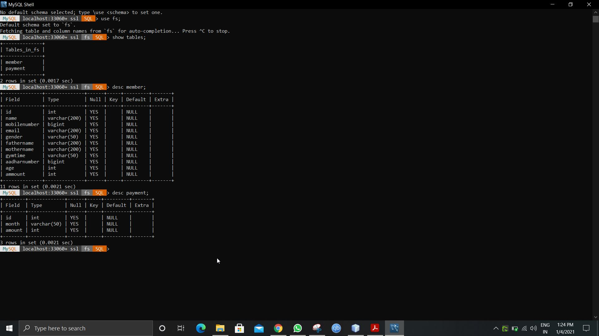

#Demo

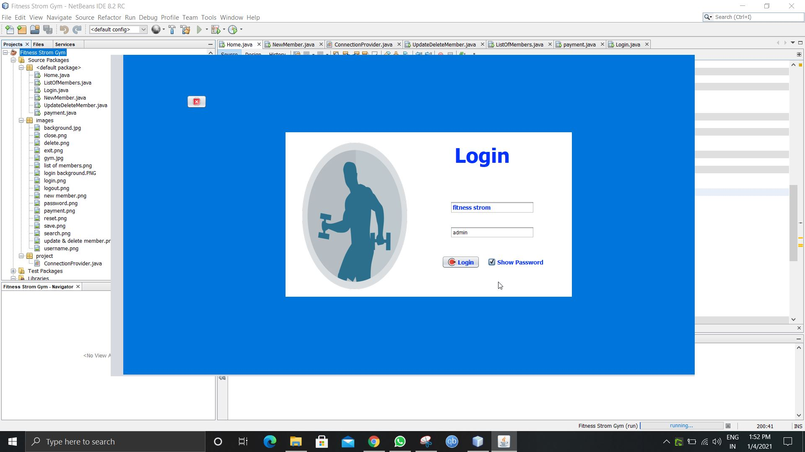
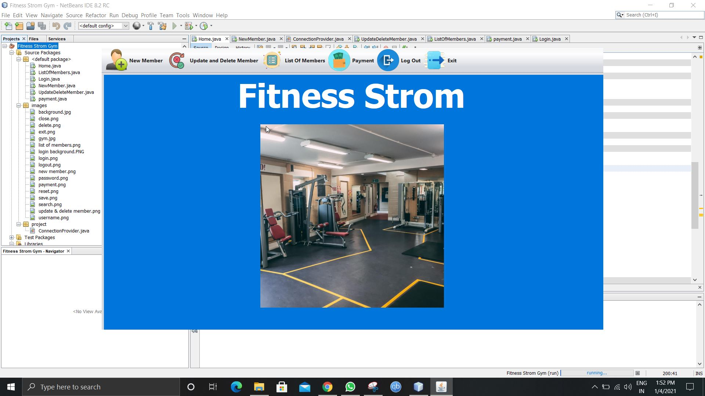
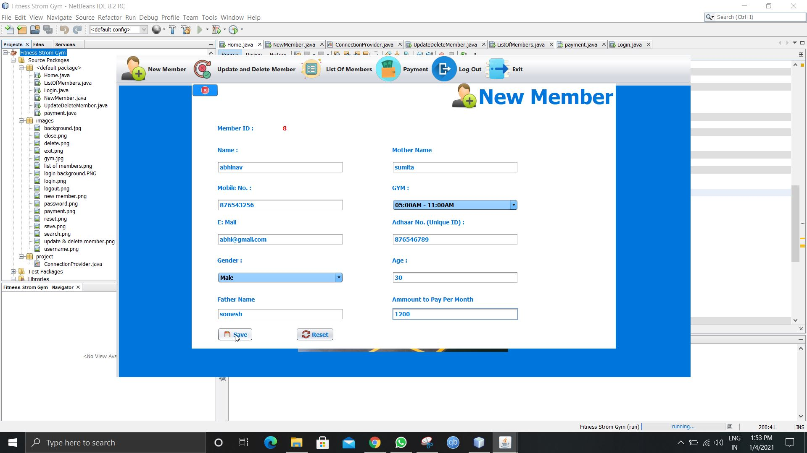

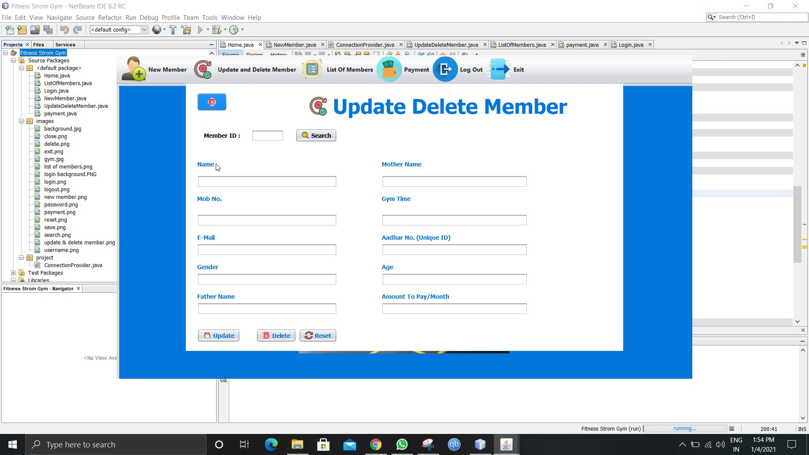
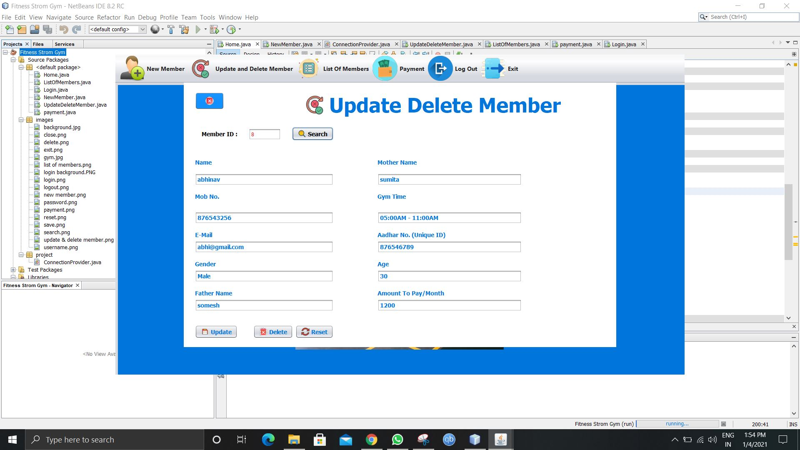
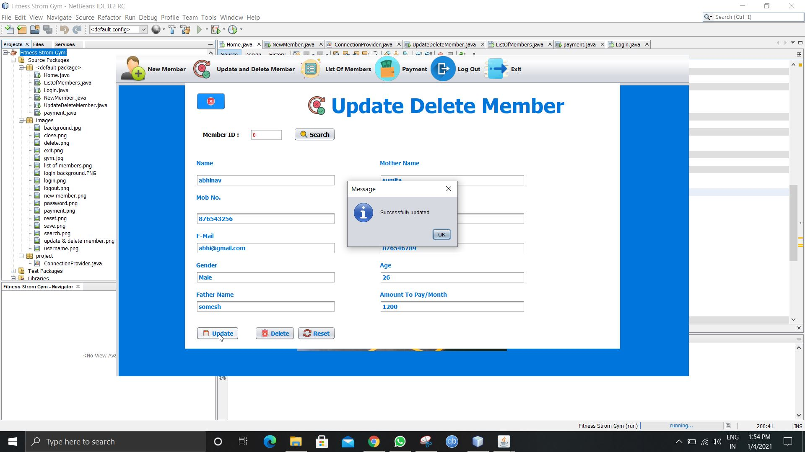

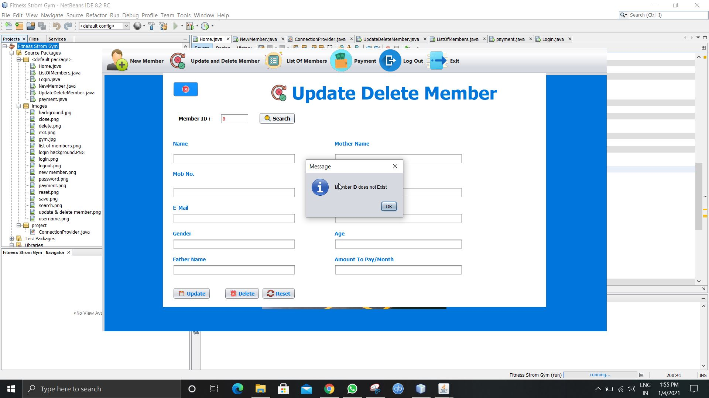
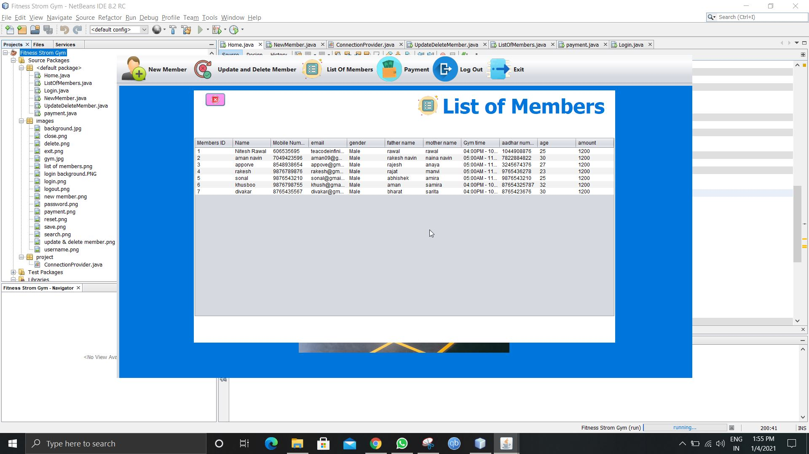
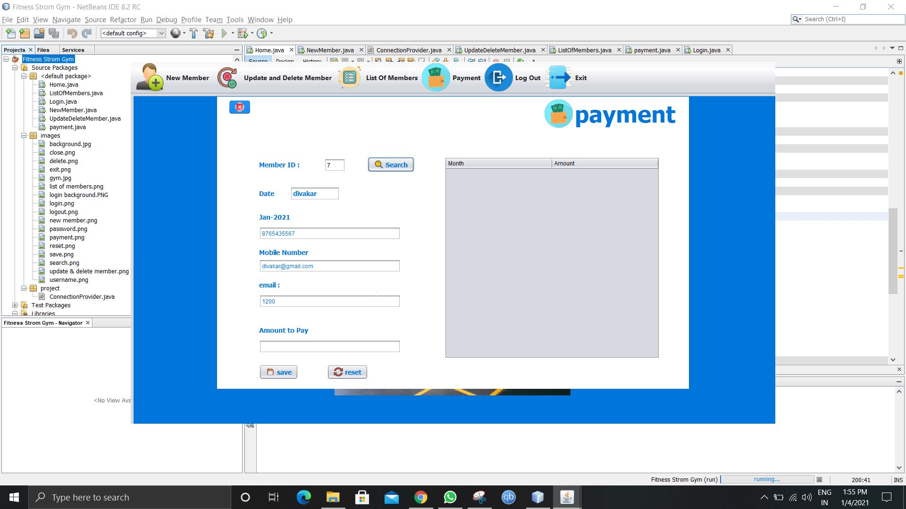
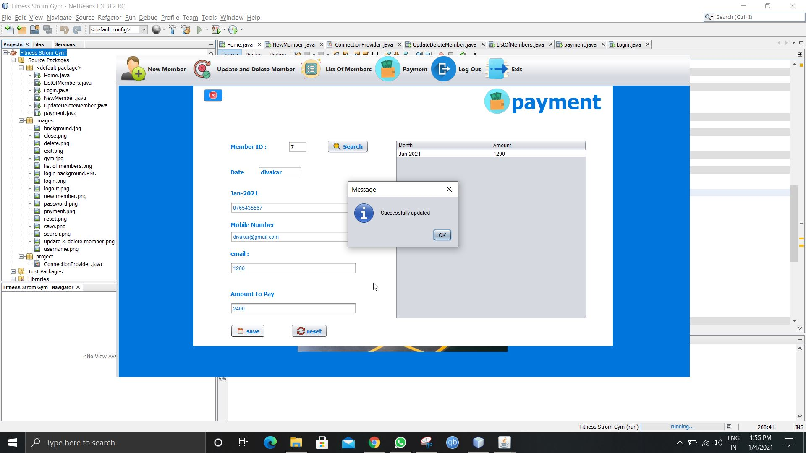

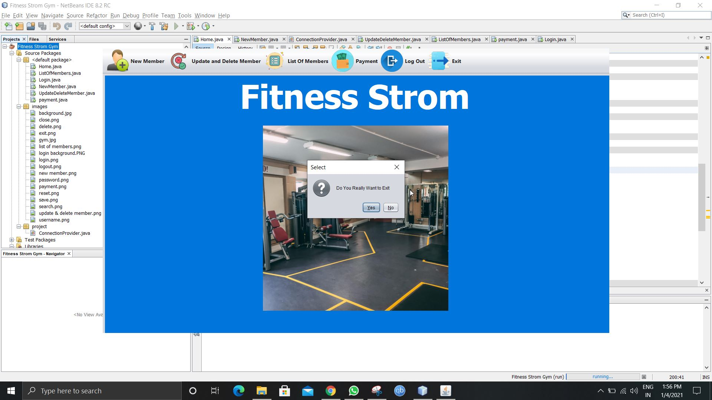

#@niteshrawal12
